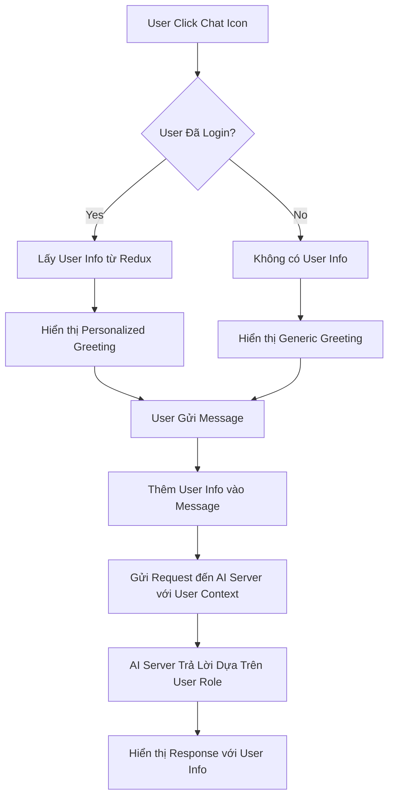

# Chatbox User Integration - Hướng Dẫn Sử Dụng

## 🎯 Tính Năng Mới

Chatbox đã được cập nhật để tích hợp thông tin user đăng nhập:

### ✅ **Tính Năng Đã Thêm:**

1. **Personalized Greeting**: Chatbox sẽ chào user bằng tên thật
2. **User Info in Messages**: Hiển thị tên và role của user trong mỗi tin nhắn
3. **Context-Aware AI**: AI Server nhận được thông tin user để tư vấn phù hợp
4. **User History**: Lưu trữ thông tin user trong lịch sử chat

## 🔧 **Cách Hoạt Động**

### 1. **Khi User Chưa Đăng Nhập:**
```
Bot: "Xin chào! Tôi là AI Assistant của JobHunter. Tôi có thể giúp bạn tìm việc làm phù hợp..."
```

### 2. **Khi User Đã Đăng Nhập:**
```
Bot: "Xin chào Nguyễn Văn A! Tôi là AI Assistant của JobHunter. Tôi có thể giúp bạn tìm việc làm phù hợp..."
```

### 3. **Trong Tin Nhắn User:**
```
[Nguyễn Văn A (USER)] Tôi muốn tìm việc làm React Developer
```

## 📊 **Cấu Trúc Dữ Liệu**

### **UserInfo Interface:**
```typescript
interface UserInfo {
  id?: string;
  name?: string;
  email?: string;
  role?: {
    id?: string;
    name?: string;
    permissions?: any[];
  };
}
```

### **Message Interface (Updated):**
```typescript
interface Message {
  id: string;
  text: string;
  sender: 'user' | 'bot';
  timestamp: Date;
  userInfo?: {
    id?: string;
    name?: string;
    email?: string;
    role?: string;
  };
}
```

## 🚀 **API Request Format**

### **Gửi đến AI Server:**
```json
{
  "message": "Tôi muốn tìm việc làm React Developer",
  "timestamp": "2024-01-15T10:30:00.000Z",
  "user": {
    "id": "123",
    "name": "Nguyễn Văn A",
    "email": "nguyenvana@email.com",
    "role": "USER",
    "permissions": ["READ_JOBS", "APPLY_JOBS"]
  }
}
```

## 🎨 **UI/UX Improvements**

### **User Info Display:**
- Hiển thị tên user trong mỗi tin nhắn
- Hiển thị role (USER, ADMIN, etc.)
- Styling đẹp với gradient và opacity

### **CSS Classes Added:**
```scss
.userInfo {
  display: flex;
  align-items: center;
  gap: 8px;
  margin-bottom: 4px;
  font-size: 12px;
  opacity: 0.8;
}

.userName {
  font-weight: 600;
  color: rgba(255, 255, 255, 0.9);
}

.userRole {
  color: rgba(255, 255, 255, 0.7);
  font-style: italic;
}
```

## 🔄 **Flow Hoạt Động**



## 🛠️ **Technical Implementation**

### **1. Redux Integration:**
```typescript
const user = useAppSelector(state => state.account.user);
const isAuthenticated = useAppSelector(state => state.account.isAuthenticated);
```

### **2. Dynamic Greeting:**
```typescript
const getGreetingMessage = () => {
  if (isAuthenticated && user?.name) {
    return `Xin chào ${user.name}! Tôi là AI Assistant của JobHunter...`;
  }
  return 'Xin chào! Tôi là AI Assistant của JobHunter...';
};
```

### **3. User Context in API:**
```typescript
const userInfo = isAuthenticated && user ? {
  id: user.id,
  name: user.name,
  email: user.email,
  role: user.role
} : undefined;

const response = await chatService.sendMessage(currentInput, userInfo);
```

## 🎯 **Benefits**

1. **Personalized Experience**: User cảm thấy được chào đón cá nhân
2. **Context-Aware AI**: AI có thể tư vấn dựa trên role và quyền của user
3. **Better UX**: Hiển thị rõ ai đang chat, tránh nhầm lẫn
4. **Data Tracking**: Có thể track được user nào đang sử dụng chat
5. **Role-Based Responses**: AI có thể đưa ra lời khuyên phù hợp với từng loại user

## 🔍 **Testing**

### **Test Cases:**
1. ✅ User chưa login → Generic greeting
2. ✅ User đã login → Personalized greeting với tên
3. ✅ User gửi message → Hiển thị tên và role
4. ✅ API request → Gửi kèm user context
5. ✅ Role-based responses → AI tư vấn phù hợp

## 🚀 **Next Steps**

1. **AI Server Integration**: Cập nhật AI Server để xử lý user context
2. **Analytics**: Track user behavior trong chat
3. **Role-Based Features**: Thêm tính năng dành riêng cho từng role
4. **Chat History**: Lưu trữ lịch sử chat theo user
5. **Multi-language**: Hỗ trợ đa ngôn ngữ dựa trên user preference
